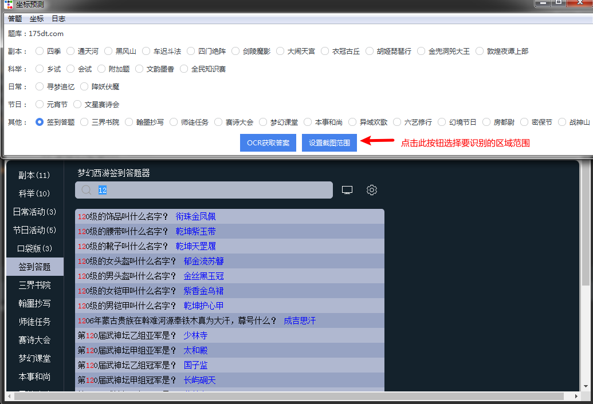
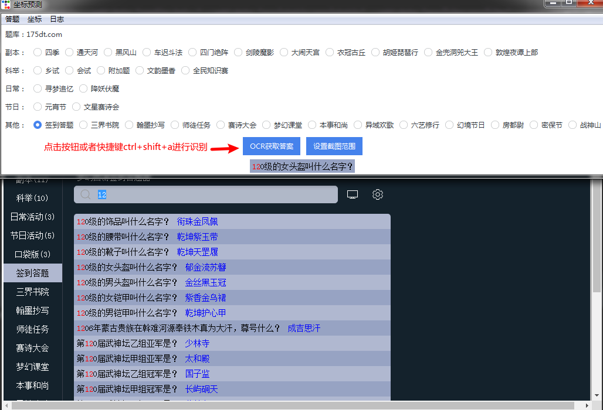
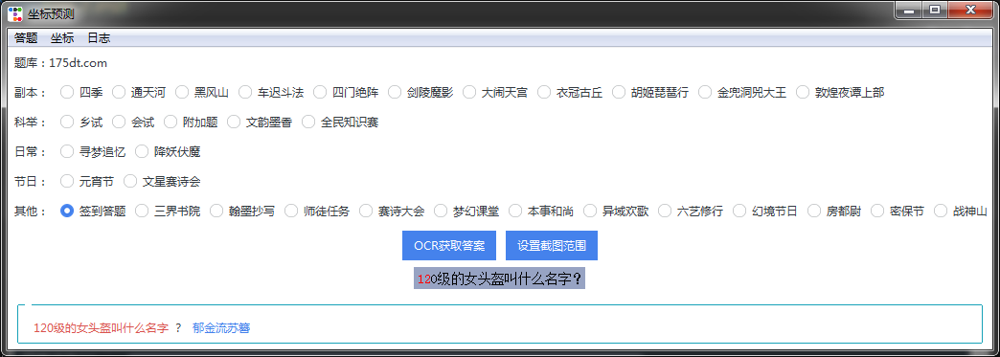
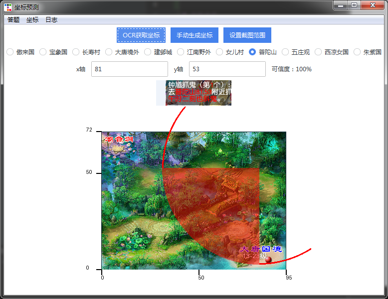

# menghuan_ocr
##  一个便利的小鬼坐标预测+答题器工具

# 离线ocr
## https://github.com/hiroi-sora/PaddleOCR-json

# 使用方式
##  坐标预测使用方式和答题一致，理论上无特殊设置，如果识别效果不佳换色弱模式或者调整截图范围

# 打包方式 
## pyinstaller --windowed --onefile --add-data "config.ini;." --add-data "src/static;src/static" --add-data "src/libs;src/libs" --name mh_ocr main.py